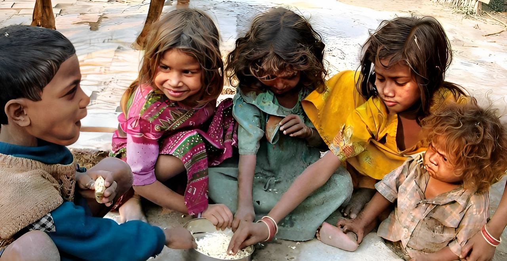

# Food waste management system
<!--  -->
<p>The basic concept of this project Food Waste Management is to collect the excess/leftover food from donors such as hotels, restaurants, marriage halls, etc and distribute it to the needy people.</p>

## Tools and Technologies
- Frontend : HTML, CSS, JavaScript
- Backend  : PHP
- Webserver: XAMPP server
- Database : MySQL

## The system has three modules
- User
- Admin
- Delivery

... (keep all your existing content here) ...

## View Project Demo

### Option 1: Host Video Inside Repo  
Place your `Project_recording.mp4` inside a folder (example: `demo/`) and then link it like this:

```html
<video width="600" controls>
  <source src="demo/Project_recording.mp4" type="video/mp4">
  Your browser does not support the video tag.
</video>
